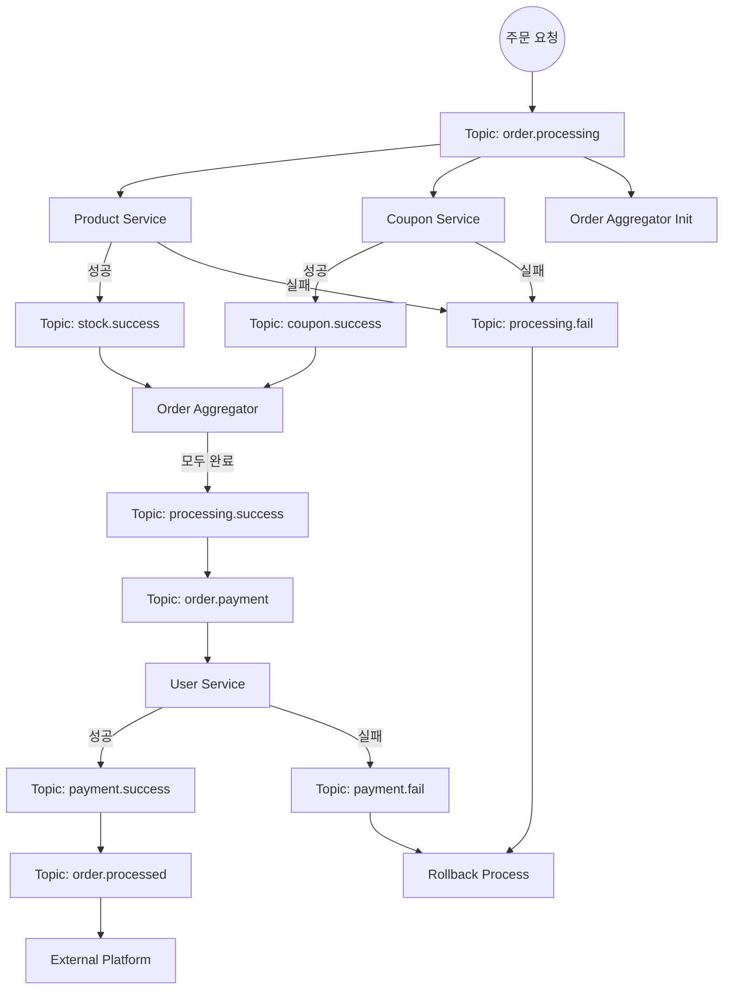
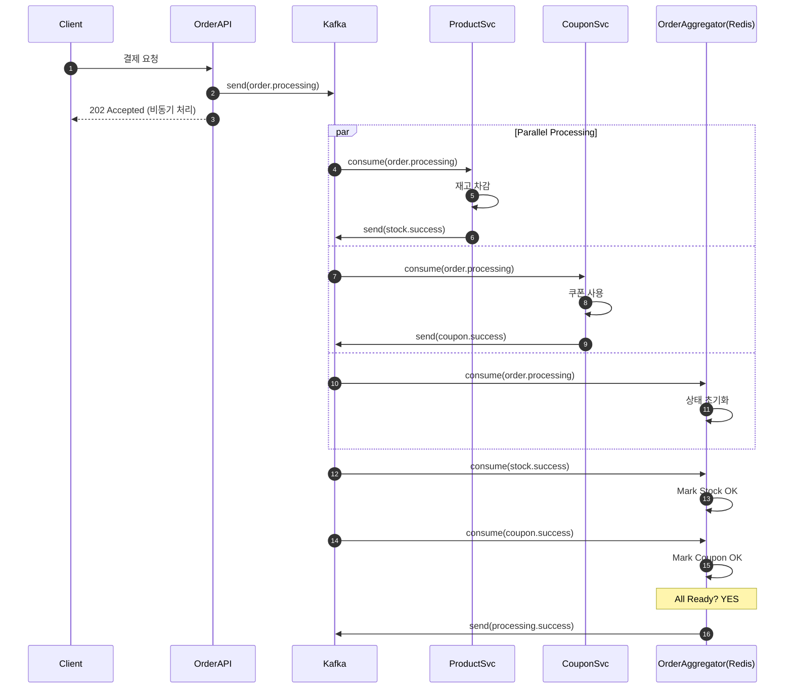
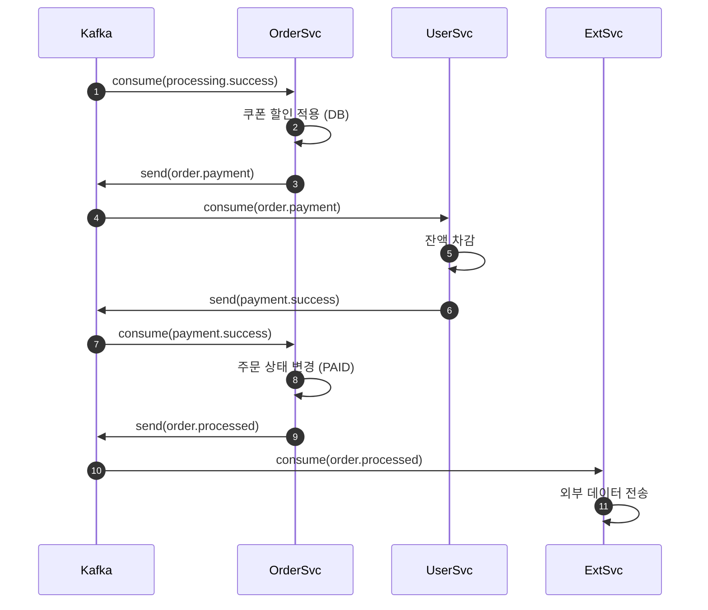
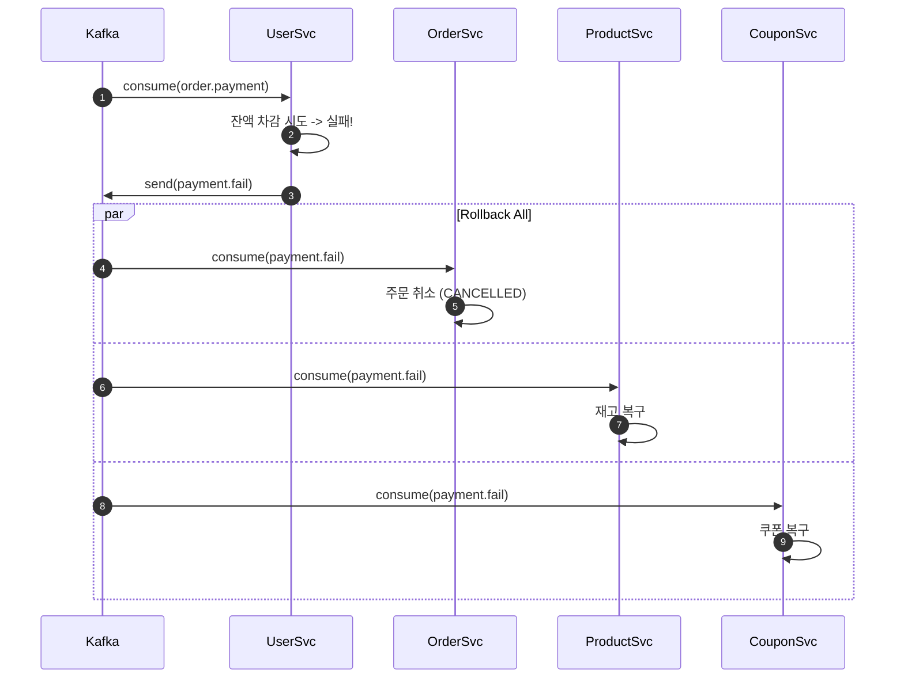

# 📋 Kafka 이벤트 흐름 다이어그램 문서 (Choreography Saga)

> 이 문서는 Kafka 기반 Choreography Saga 패턴의 상세 이벤트 흐름을 설명합니다.
> 아키텍처 설계에 대한 내용은 [KAFKA-EVENT-DRIVEN-ARCHITECTURE.md](./KAFKA-EVENT-DRIVEN-ARCHITECTURE.md) 문서를 참고하세요.

---

## 📑 목차

1. [전체 이벤트 흐름도](#1-전체-이벤트-흐름도)
2. [상세 시퀀스 다이어그램 (Happy Path)](#2-상세-시퀀스-다이어그램-happy-path)
3. [보상 트랜잭션 흐름 (Failure Path)](#3-보상-트랜잭션-흐름-failure-path)

---

## 1. 전체 이벤트 흐름도

---

## 2. 상세 시퀀스 다이어그램 (Happy Path)

### 2.1 초기화 및 병렬 처리 (Processing Phase)

### 2.2 결제 및 완료 (Payment Phase)

---

## 3. 보상 트랜잭션 흐름 (Failure Path)

### 3.1 잔액 부족 시 (Payment Fail)

