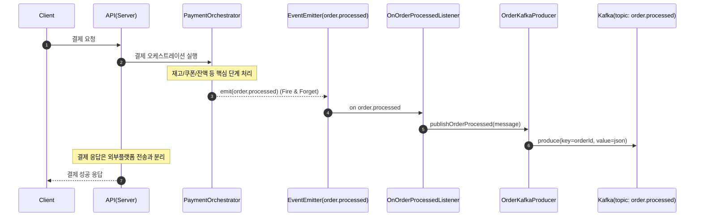
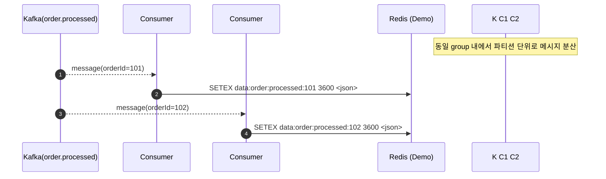

# 📦 Kafka 기반 외부플랫폼 데이터 전송 설계 문서

> 이 문서는 **주문 결제 완료 후 발생하는 외부플랫폼 전송(파일 쓰기, S3 적재, DWH 적재 등 “과부하 작업”)**을 API 처리 경로에서 분리하기 위해
> Kafka를 도입한 설계/구현을 정리합니다.

---

## 📌 배경 및 문제 정의

### AS-IS (문제)

- 결제 완료 직후 외부 플랫폼 전송을 **동기 처리**하거나, 동일 프로세스 내에서 **즉시 실행**하면:
  - 요청 지연 증가 (P95/P99 악화)
  - 피크 트래픽 시 처리량 저하 및 타임아웃 가능
  - 외부 시스템(S3/DWH) 장애가 결제 흐름에 간접 영향
  - “무거운 작업” 스케일 아웃이 어려움

### TO-BE (목표)

- 결제 핵심 흐름(재고/쿠폰/잔액/주문상태)은 빠르게 완료
- 외부플랫폼 전송은 **비동기 처리 + 워커(컨슈머) 스케일 아웃**로 부하 분산
- 메시지 기반(버퍼링)으로 피크 트래픽 흡수

---

## ✅ 설계 요약

- 애플리케이션 내부 이벤트(`order.processed`)는 **결제 성공 이후 부가 작업 트리거**로 사용
- `Order` 도메인의 `OnOrderProcessedListener`가 Kafka 토픽 `order.processed`에 메시지 발행
- 외부플랫폼 컨슈머(`ExternalPlatformKafkaConsumer`, groupId=`external-platform-redis-group`)가 토픽을 구독하여 과부하 작업 수행
  - Demo 구현: Redis에 TTL 1시간으로 저장
  - 실제 환경: 파일 쓰기, S3 적재, 데이터 웨어하우스 적재 등으로 확장 가능

---

## 🧩 구성 요소(코드 기준)

- 프로듀서(발행)
  - `src/order/infrastructure/order.kafka.producer.ts`
    - `topic`: `order.processed`
    - `key`: `String(orderId)` (파티셔닝/순서 보장 단위)

- 내부 이벤트 리스너 → Kafka 발행 브리지
  - `src/order/application/listeners/on-order-processed.listener.ts`
    - `@OnEvent(OrderProcessedEvent.EVENT_NAME)` 수신
    - `orderKafkaProducer.publishOrderProcessed(...)` 호출

- 컨슈머(소비)
  - `src/order/presentation/consumers/external-platform.kafka.consumer.ts`
    - `topic`: `order.processed`
    - `groupId`: `external-platform-redis-group`
    - Demo: Redis `SETEX data:order:processed:{orderId} 3600 <json>`

- 공통 Kafka 모듈
  - `src/@common/kafka/kafka.module.ts` (`GlobalKafkaModule`): Producer 제공
  - `src/@common/kafka/kafka.base.consumer.ts`: Consumer 베이스
  - `src/@common/kafka/kafka.config.ts`: Kafka client 설정

---

## 🔄 비즈니스 시퀀스 다이어그램

### 1) 결제 완료 → Kafka 발행 (API 경로에서 “과부하 작업” 분리)



### 2) Kafka 소비 → 과부하 작업 처리 (워커 스케일 아웃)



---

## 🧱 Kafka 토픽/메시지 설계

### 토픽

- `order.processed`
  - 목적: “결제 완료 후 부가 작업(외부플랫폼 전송/분석 적재)”을 비동기로 처리

### 메시지 키(파티셔닝)

- `key = String(orderId)`
  - 같은 `orderId`에 대해서는 동일 파티션으로 라우팅되어 **순서 보장**에 유리
  - 컨슈머를 수평 확장하면 파티션 단위로 처리량이 증가

### 메시지 스키마

- 코드 기준 인터페이스
  - `src/order/infrastructure/order.kafka.producer.ts` 의 `OrderProcessedMessage`

```ts
export interface OrderProcessedMessage {
  orderId: number;
  userId: number;
  finalAmount: number;
  couponId: number | null;
  items: {
    productOptionId: number;
    productName: string;
    quantity: number;
    price: number;
  }[];
  processedAt: string;
}
```

---

## ⚙️ Kafka 구성(개발 환경)

- `docker-compose.yaml`에 단일 노드 Kafka(Dev)와 `kafka-ui`가 포함
- 애플리케이션 설정
  - `KAFKA_CLIENT_ID` (기본값: `ecommerce-app`)
  - `KAFKA_BROKERS` (기본값: `localhost:9094`)

---

## 🧯 장애/재처리 관점(현재/향후)

### 현재 구현의 성격

- 외부플랫폼 전송은 **결제 핵심 성공/실패에 영향이 없는 부가 작업**으로 분리
- Demo 컨슈머는 Redis 저장으로 대체되어 있으며, 실제 “과부하 작업” 위치는 컨슈머로 이동

### 중복/재처리(At-least-once) 고려

- Kafka 소비는 기본적으로 **중복 전달 가능성**이 있으므로 컨슈머는 **멱등성(idempotency)**을 가져야 함
  - Demo에서는 `data:order:processed:{orderId}`에 동일 키로 저장하므로 overwrite가 가능(멱등에 가까움)

### 실패 처리(향후 권장)

- `KafkaBaseConsumer`는 현재 `handleMessage` 예외를 잡아 로그만 남깁니다.
  - 운영 환경에서는 다음 중 하나를 권장:
    - 재시도 정책(백오프/횟수 제한)
    - DLQ 토픽 분리(예: `order.processed.dlq`)
    - 처리 실패 건을 별도 저장 후 재처리 파이프라인 구성

---

## 🧭 운영/확장 전략

- 컨슈머 스케일 아웃
  - 동일 `groupId=external-platform-redis-group`로 컨슈머 인스턴스를 늘리면 파티션 단위로 부하 분산
  - 처리량이 더 필요하면 토픽 파티션 수를 늘리고, 컨슈머 인스턴스 수를 맞춤

- 프로세스 분리(권장)
  - 현재 `OrderModule`에 컨슈머가 함께 등록되어 있으나, 운영 환경에서는
    - API 서버(HTTP)와
    - 컨슈머 워커(백그라운드)
      를 별도 프로세스로 분리하는 구성이 안전합니다.

---

## 🔗 참고

- 기존 이벤트 기반 설계: `docs/EVENT-DRIVEN-ARCHITECTURE.md`
- 이벤트 흐름 다이어그램: `docs/EVENT-FLOW-DIAGRAM.md`
