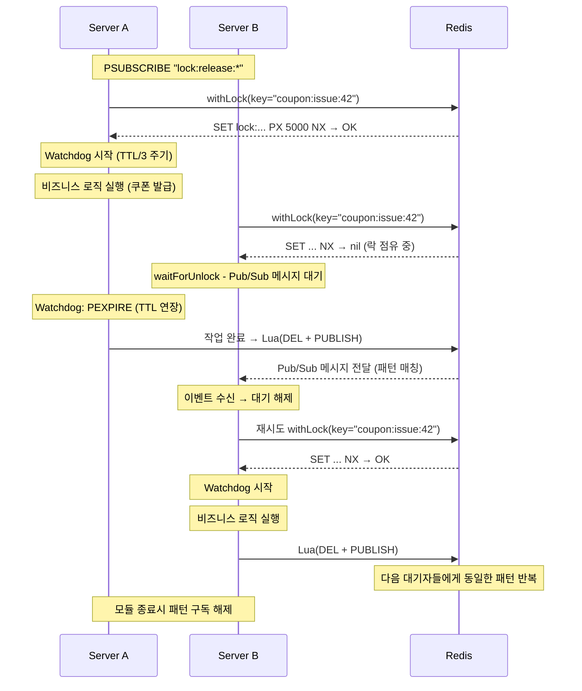

# Redis Lock Timeline (2 App Servers, 1 Redis Cluster)

이 문서는 `RedisLockService.withLock` 사용 시 **서버 2대 + 단일(클러스터링 가능한) Redis 노드** 환경에서 동시성이 어떻게 보장되는지 시계열로 설명합니다. Pub/Sub 기반으로 Redis 부하를 줄이는 전략에 초점을 둡니다.

## 등장 컴포넌트

- **Server A / Server B**: NestJS 애플리케이션 인스턴스(오토스케일링된 2대 예시)
- **Redis (Cluster)**: 단일 엔드포인트를 가진 Redis. 내부적으로는 클러스터일 수 있음.
- **Pub/Sub 채널**: `lock:release:{key}` 네임스페이스. 락 해제 이벤트 전달
- **Watchdog**: TTL 자동 연장을 위한 주기적 타이머 (TTL의 1/3 주기)

## 시계열 다이어그램



### 키 네이밍 규칙

| 용도         | 형식                 | 예시                           |
| ------------ | -------------------- | ------------------------------ |
| 락 키        | `lock:{key}`         | `lock:coupon:issue:42`         |
| Pub/Sub 채널 | `lock:release:{key}` | `lock:release:coupon:issue:42` |

### 동작 요약

0. **모듈 초기화 시 패턴 구독**: `onModuleInit`에서 `PSUBSCRIBE lock:release:*`로 모든 락 해제 이벤트를 구독합니다. 이는 서버가 시작될 때 한 번만 수행되며, 이후 모든 락 키에 대한 해제 이벤트를 수신할 수 있습니다.
1. **최초 획득**: Server A가 `SET key token PX ttl NX`로 락을 획득하고 Watchdog를 시작합니다.
2. **경쟁 요청**: Server B는 동일 키로 락을 요청하지만 `SET NX`가 `nil`을 반환하여 실패합니다.
3. **이벤트 기반 대기**: Server B는 `waitForUnlock` 로직을 통해 이벤트를 기다립니다. 만약 waitTimeout(기본 1000ms)이 지나면 이벤트를 기다리지 않고 즉시 재시도합니다.
4. **TTL 자동 연장 (Watchdog)**: 락 보유 중 TTL의 1/3 주기마다 Lua 스크립트로 TTL을 연장합니다. 토큰 검증 후 본인 락만 연장하여 동시성을 보장합니다.
5. **락 해제 + 알림**: Server A 작업 완료 → Lua 스크립트로 `DEL` + `PUBLISH`를 원자적으로 실행합니다.
6. **재획득**: Server B는 이벤트를 수신 후 `withLock`을 재시도하여 락을 획득하고 작업을 수행합니다.
7. **모듈 종료 시 구독 해제**: `onModuleDestroy`에서 `subscriber.quit()`를 호출하여 자동으로 구독이 해제됩니다.
8. **최대 대기 시간 제한**: `MAX_WAIT_TIME`(10초)을 초과하면 `RedisLockWaitTimeoutException`을 발생시켜 메모리 누수를 방지합니다.

이 과정을 통해 서버 수가 늘어나도 Redis에 대한 불필요한 재시도(폴링)를 최소화하면서 순차 실행이 보장됩니다.

## 동시성 보장 포인트

- **SET NX PX**: Redis의 원자적 조건부 설정으로 락 획득의 원자성 보장
- **Watchdog (TTL 자동 연장)**: TTL의 1/3 주기마다 Lua 스크립트로 TTL 연장. 토큰 검증으로 본인 락만 연장
- **Lua 스크립트 원자성**: 락 해제 시 `GET` → `DEL` → `PUBLISH`를 원자적으로 실행하여 Race Condition 방지
- **Pub/Sub 패턴 구독**: 모듈 초기화 시 `PSUBSCRIBE lock:release:*`로 모든 락 해제 이벤트를 구독하여, 실패 시 즉시 재시도하지 않고 이벤트 기반으로 기다려 Redis 부하 완화
- **이벤트 리스너 등록/해제**: `waitForUnlock` 내에서 `pmessage` 이벤트 리스너를 등록하고, 이벤트 수신 또는 타임아웃 시 리스너를 해제하여 메모리 누수 방지
- **키 네임스페이스**: `lock:{key}` / `lock:release:{key}` 구조로 리소스별로 독립적인 락/이벤트 흐름 유지
- **MAX_WAIT_TIME 제한**: 전체 `withLock` 대기 시간이 10초를 초과하면 예외를 발생시켜 무한 대기 및 메모리 누수 방지

## 5초 내외 무거운 로직 실행 시

```typescript
await this.withLock('coupon:issue:1', fn, {
  ttl: 5000, // 락은 5초 후 자동 만료 (기본값)
  waitTimeout: 1000, // 대기자는 최대 1초간 이벤트 기다림 (기본값)
});
// 참고: 전체 withLock 대기 상한은 MAX_WAIT_TIME = 10초
```

```
시간(초)  Server A              Server B
─────────────────────────────────────────────
0.0       락 획득 (TTL=5s)
          Watchdog 시작 (1.67s 주기)
0.0                              락 대기 시작
1.0                              waitTimeout 만료 → 재시도
1.0                              락 획득 시도 → 실패 (A가 보유 중)
1.0                              다시 대기...
1.67      Watchdog: PEXPIRE ✅
          (TTL 5초로 연장)
2.0                              waitTimeout 만료 → 재시도
2.0                              락 획득 시도 → 실패
3.0                              waitTimeout 만료 → 재시도
3.33      Watchdog: PEXPIRE ✅
5.0       Watchdog: PEXPIRE ✅
5.5       작업 완료, 락 해제
5.5                              Pub/Sub 수신 → 락 획득
```

```typescript
// Watchdog: TTL의 1/3 주기마다 자동 연장
private startWatchdog(key: string, token: string, ttl: number): NodeJS.Timeout {
  return setInterval(async () => {
    // Lua 스크립트로 토큰 검증 후 TTL 연장
    await this.client.eval(extendScript, 1, key, token, ttl);
  }, ttl / 3);  // ← 5초 TTL이면 ~1.67초마다 연장
}
```

Watchdog이 TTL의 1/3 주기(약 1.67초)마다 TTL을 연장합니다. 이를 통해 5초 내외의 무거운 작업도 안전하게 처리할 수 있습니다.
