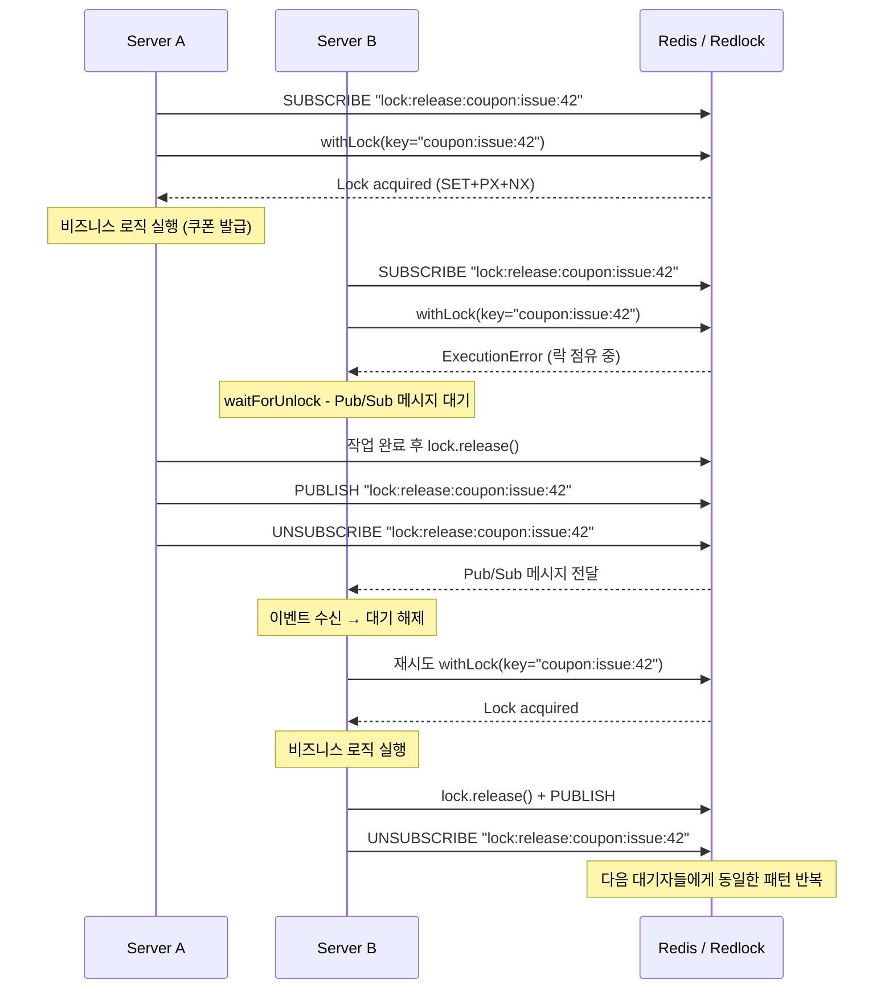

# Redis Lock Timeline (2 App Servers, 1 Redis Cluster)

이 문서는 `RedisLockService.withLock` 사용 시 **서버 2대 + 단일(클러스터링 가능한) Redis 노드** 환경에서 동시성이 어떻게 보장되는지 시계열로 설명합니다. Redlock 과 Pub/Sub 결합으로 Redis 부하를 줄이는 전략에 초점을 둡니다.

## 등장 컴포넌트

- **Server A / Server B**: NestJS 애플리케이션 인스턴스(오토스케일링된 2대 예시)
- **Redis (Cluster)**: 단일 엔드포인트를 가진 Redis. 내부적으로는 클러스터일 수 있으나 Redlock 대상은 동일
- **Redlock**: `ioredis` 기반 분산락 알고리즘 구현. 각 서버 인스턴스당 1개
- **Pub/Sub 채널**: `lock:release:{key}` 네임스페이스. 락 해제 이벤트 전달

## 시계열 다이어그램



### 키 네이밍 규칙

| 용도         | 형식                 | 예시                           |
| ------------ | -------------------- | ------------------------------ |
| 락 키        | `lock:{key}`         | `lock:coupon:issue:42`         |
| Pub/Sub 채널 | `lock:release:{key}` | `lock:release:coupon:issue:42` |

### 동작 요약

0. **락 획득 전 사전 구독**: `lock:release:*` 채널을 구독하여 락 해제 이벤트를 수신 대기합니다.
1. **최초 획득**: Server A 가 Redlock `SET PX NX`로 락을 획득하고 작업을 수행합니다.
2. **경쟁 요청**: Server B 는 동일 키로 락을 요청하지만 Redlock 이 `ExecutionError` 를 던져 즉시 실패합니다.
3. **이벤트 기반 대기**: Server B 는 `waitForUnlock` 로직을 통해 이벤트를 기다립니다. 만약 waitTimeout(기본 1000ms) 이 지나면 이벤트를 기다리지 않고 즉시 재시도합니다.
4. **락 해제 + 알림**: Server A 작업 완료 → Redlock `release()` → `PUBLISH` 로 대기자들에게 알립니다. 같은 채널로 전달된 Pub/Sub 메시지를 구독 중인 모든 대기자가 수신하여 즉시 재시도합니다.
5. **재획득**: Server B 는 이벤트를 수신 후 `withLock` 을 재시도하여 락을 획득하고 작업을 수행합니다.
6. **TTL 연장**: 락 획득 이후 수행하는 작업이 TTL 내 미완료 시 Redlock 의 automatic extension 이 동작하여 동시성을 보장합니다.
7. **구독 해제**: 작업 완료 후 `lock:release:*` 채널의 구독을 해제합니다.

이 과정을 통해 서버 수가 늘어나도 Redis 에 대한 불필요한 재시도(폴링)를 최소화하면서 순차 실행이 보장됩니다.

## 동시성 보장 포인트

- **Redlock**: TTL, driftFactor, automaticExtensionThreshold 로 안전한 락 소유를 보장
- **Pub/Sub**: 실패 시 즉시 재시도하지 않고 이벤트 기반으로 기다려 Redis 부하 완화
- **키 네임스페이스**: `lock:{key}` / `lock:release:{key}` 구조로 리소스 별로 독립적인 락/이벤트 흐름 유지

## Edge Case : 5초 내외 무거운 로직 실행 시

```
await this.withLock('coupon:issue:1', fn, {
  ttl: 5000,        // 락은 5초 후 자동 만료
  waitTimeout: 5000 // 대기자는 최대 5초간 이벤트 기다림
});
```

```
시간(초)  Server A              Server B
─────────────────────────────────────────────
0.0       락 획득 (TTL=5s)
0.0                              락 대기 시작
4.5       자동 연장 트리거 ✅
          (automaticExtensionThreshold=500ms)
5.0       작업 계속 중...        waitTimeout 만료 → 재시도
5.0                              락 획득 시도 → 실패 (A가 연장함)
5.0                              다시 대기...
5.5       작업 완료, 락 해제
5.5                              Pub/Sub 수신 → 락 획득
```

```
this.redlock = new Redlock([this.client], {
  automaticExtensionThreshold: 500, // ← 이 설정이 중요!
});
```

redlock 의 `automaticExtensionThreshold` 설정을 통해 TTL 만료 500ms 전에 자동 연장이 이루어지도록 합니다. 이를 통해 5초 내외의 무거운 작업도 안전하게 처리할 수 있습니다.
