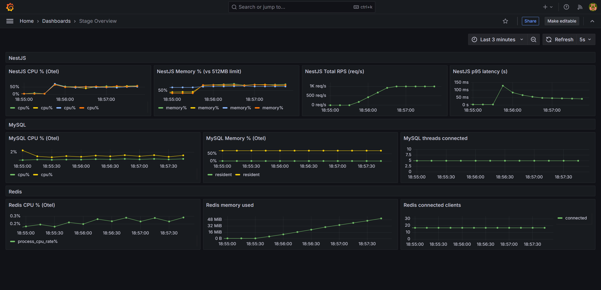
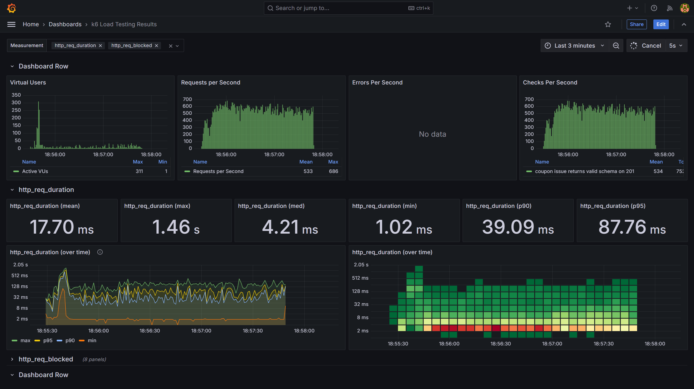
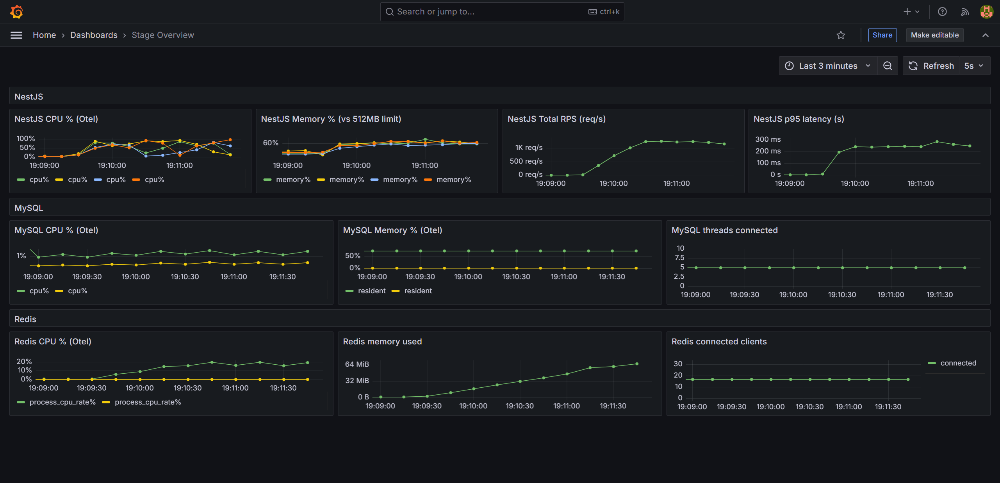
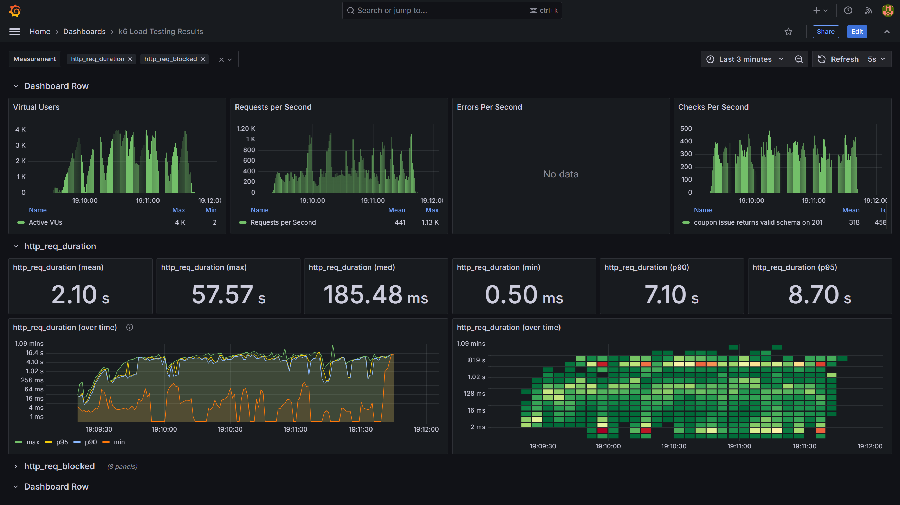
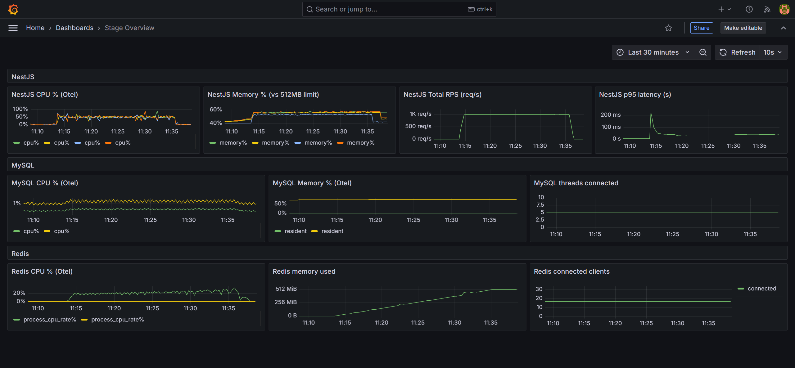
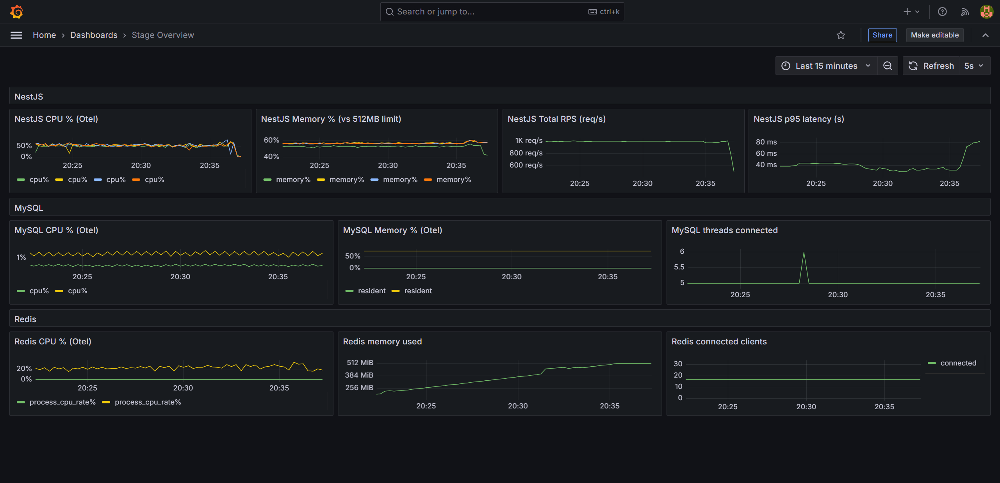
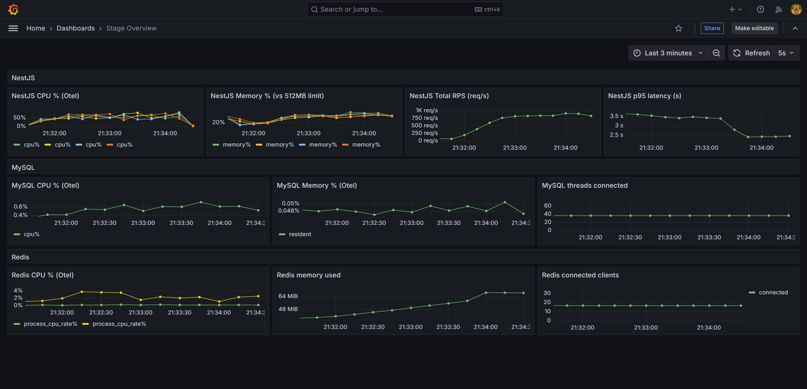
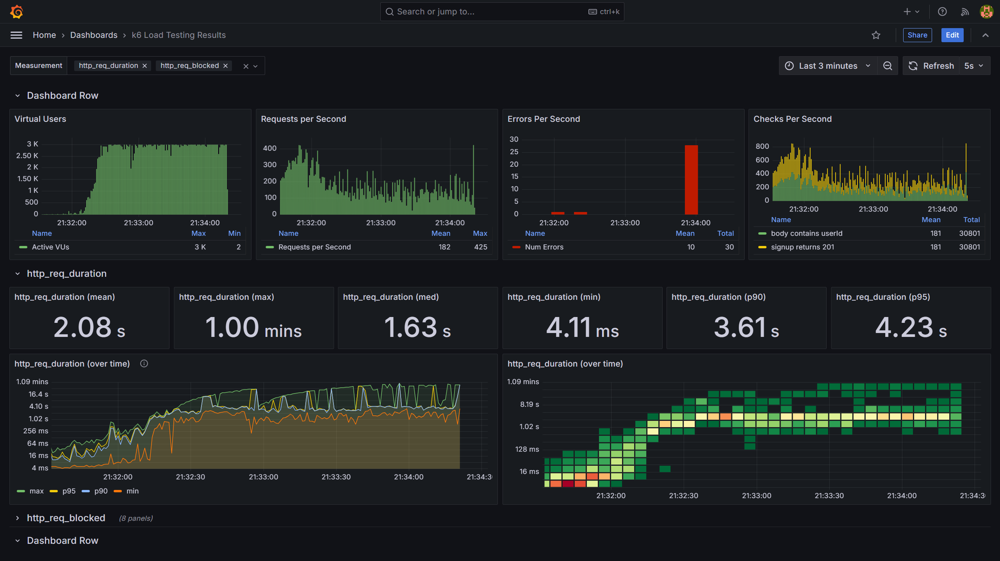
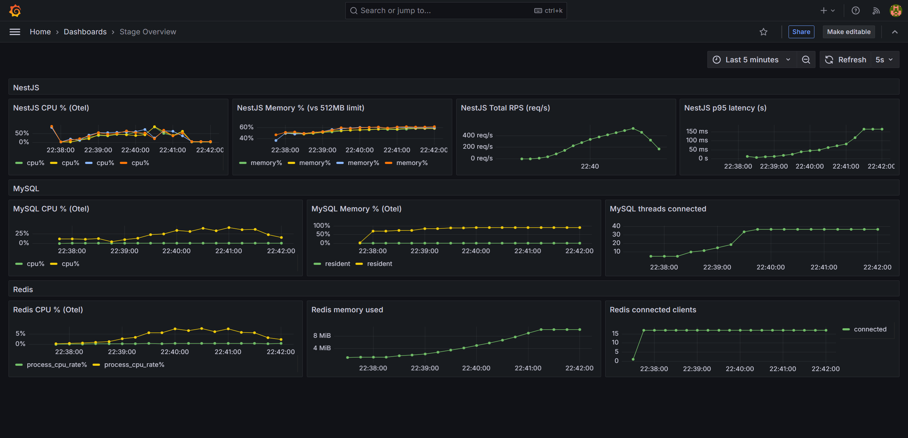
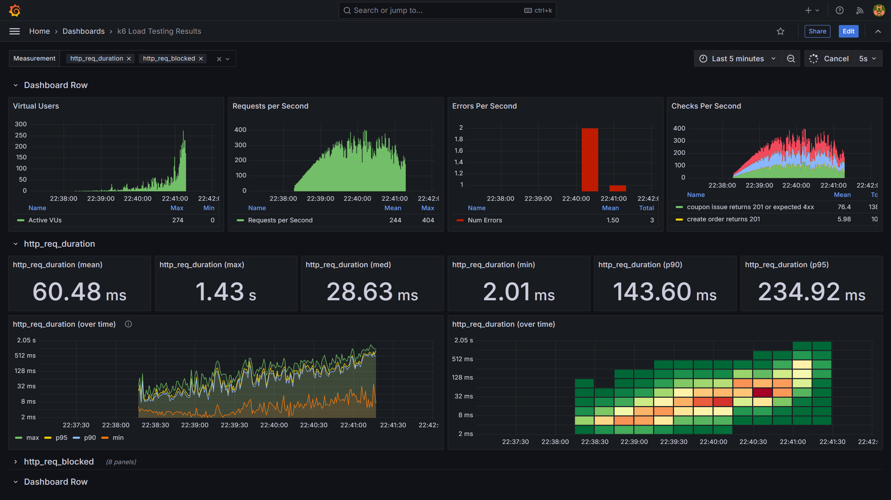

# k6 부하 테스트 및 시스템 장애지점 탐색 보고서

## 테스트 스펙

#### Server PC 하드웨어 스펙

- CPU: Inter N150 (4 cores 4 threads) @ 2.00GHz (AWS EC2 t3.large 인스턴스와 유사 성능)
- RAM: 16GB
- 디스크: SSD M.2 NVMe (Read / Write 2000MB/s)

#### Client PC 하드웨어 스펙

- CPU: AMD Ryzen 9 9600X (6 cores 12 threads) @ 3.80GHz

#### 네트워크 환경

- ipTIME A1004NS 공유기 내부망 IP로 직접 통신
- Server PC 케이블 : cat7 이더넷 케이블, 10Gbps 지원
- Client PC 케이블 : cat7 이더넷 케이블, 10Gbps 지원

#### 기타 제약사항

- **서버와 클라이언트는 물리적으로 분리된 PC 사용**
- redis, mysql, kafka \* 3, Nest App \* 4 컨테이너 모두 단일 서버 PC에서 운영
  - CPU, RAM, 디스크 I/O 자원 경쟁 발생 가능

## 목표

#### 대상별 목표 설정

- Redis 기반 쿠폰발급 API의 최대 처리량(Throughput) 측정
- MySQL 기반 회원가입 API의 최대 처리량(Throughput) 측정
- 운영 시나리오(회원가입 + 쿠폰발급 + 상품조회 + 확률적(5%) 주문프로세스(주문/결제/외부플랫폼전송))의 최대 처리량(Throughput) 측정

#### 최대 처리량 산정 기준

```javascript
  stress: {
    executor: 'ramping-arrival-rate',
    preAllocatedVUs: 4000,
    maxVUs: 4000,
    stages: [
      { duration: '5s', target: 1000 }, // 워밍업
      { duration: '30s', target: 2000 }, // 부하 임계점 1 측정
      { duration: '30s', target: 3000 }, // 부하 임계점 2 측정
      { duration: '30s', target: 4000 }, // 부하 임계점 3 측정
    ],
  },
```

- k6 스트레스 테스트 시나리오를 실행
- 각 부하 임계점 단계별로 THRESHOLDS p95 응답시간(p95 < 500ms) 및 성공률(rate > 0.99) 측정

## 테스트 결과

### Redis 기반 쿠폰발급 API 피크 테스트

- k6 스크립트 경로: `k6/redis.issue-coupon.script.js`

```javascript
  peak: {
    executor: 'ramping-arrival-rate',
    startRate: 10,
    timeUnit: '1s',
    preAllocatedVUs: 4000,
    maxVUs: 4000,
    stages: [
      { duration: '10s', target: 1500 }, // 최고 부하 점진적으로 증가
      { duration: '120s', target: 1500 }, // 최고 부하 지속
    ],
  }
```

#### 서버 docker 인스턴스 사양 제약

- MySQL : 1cpu, 512M RAM
- Redis : 1cpu, 512M RAM
- Kafka (3 brokers) : 각 1cpu, 512M RAM
- NestJS App (4 instances) : 각 1cpu, 512M RAM

#### 1,000 RPS x 2분

|                  Dashboard Result                   |                  InfluxDB Result                  |
| :-------------------------------------------------: | :-----------------------------------------------: |
|  |  |

- p95 응답시간: 83ms
- 오류율: 0.0%
- 최대 처리량 : 1,000 RPS
- 장애 확인 : 없음
- 조치 사항 : 없음

#### 1,500 RPS x 2분

|                  Dashboard Result                   | InfluxDB Result                                   |
| :-------------------------------------------------: | ------------------------------------------------- |
|  |  |

- p95 응답시간: 8.7s
- 오류율: 0.9% (502 Bad Gateway)
- 최대 처리량 : 1,500 RPS
- 장애 확인 :
  - 1,500 RPS 이상의 처리량 지속시 Load Balancer(nginx)에서 WAS에 접근하지 못하는 오류 발생
  - 부하 지속 시 서버의 처리량이 회복되지 않고 지속적으로 저하(`평시 2000 RPS까지 처리가능, 부하 지속시 600 RPS까지 병목 발생`)되는 문제 발생
- 진단을 위한 지표 분석 대상 : NestJS Memory %
  - `otel_container_memory_percent_ratio{container_name=~".*app.*"}`
- 장애 원인: NestJS App의 메모리 부족
- 조치 사항: `docker-compose.stage.yaml` 에서 NestJS App 메모리 제한을 512MB -> 2GB 로 상향 조정 시 4,000 RPS 까지 오류 없이 처리 가능 확인
- 추가 조치 권장
  - NestJS Memory % 지표 60% 이상 1분 이상 발생시 경고 알림 적용
  - Otel 지표가 아닌 프로세스 메모리 사용량 지표 추가 활용 권장
  - 알림 채널 : Slack / Grafana Oncall

### 1,000 RPS 장시간 테스트 (20분)

|                       Dashboard Result                        |                       InfluxDB Result                       |
| :-----------------------------------------------------------: | :---------------------------------------------------------: |
|  |  |

- p95 응답시간: 70ms
- 오류율: 19분까지 0%, 19분 경과 후 100% 오류 발생
- 장애 확인
  - 장시간 테스트 시 레디스 메모리 부족(Max 512MB)으로 인한 Redis Simple OOM 오류 발생
- 진단을 위한 지표 분석 대상 : Redis 메모리 사용량
  - `redis_memory_used_bytes`
- 장애 원인: Redis 메모리 부족
- 조치 사항: Redis 컨테이너 메모리 제한을 512MB보다 상향 조정 시 장애 해소 확인 (TTL이 긴 NoSQL 성격의 Redis는 충분한 메모리 할당 권장)
- 추가 조치 권장 : Redis 메모리 사용량 지표 이상 발생시 경고 알림 적용
  - 알림 임계치 : Redis 메모리 사용량 80%
  - 알림 채널 : Slack / Grafana Oncall

### MySQL 기반 회원가입 API 스트레스 테스트

- k6 스크립트 경로: `k6/db-write.signup.script.js`

```javascript
  stress: {
    executor: 'ramping-arrival-rate',
    startRate: 10,
    timeUnit: '1s',
    preAllocatedVUs: 3000,
    maxVUs: 3000,
    stages: [
      { duration: '60s', target: 1000 }, // 부하 임계점 1 측정
      { duration: '60s', target: 2000 }, // 부하 임계점 2 측정
      { duration: '60s', target: 3000 }, // 부하 임계점 3 측정
    ],
  },
```

#### 서버 docker 인스턴스 사양 제약

- MySQL : 1cpu, 512M RAM
- Redis : 1cpu, 512M RAM
- Kafka (3 brokers) : 각 1cpu, 512M RAM
- NestJS App (4 instances) : 각 1cpu, **2G RAM**

#### 1,000 RPS x 1분, 2000 RPS x 1분, 3,000 RPS x 1분

|                Dashboard Result                 |                InfluxDB Result                |
| :---------------------------------------------: | :-------------------------------------------: |
|  |  |

- 최대 처리량 : 2,000 RPS
- 장애 확인 : 없음
- 오류 확인 : 3000 RPS 구간에서 `Prisma DB Connection Timeout` 오류 발생
- 원인 : 싱글톤 Prisma 인스턴스의 커넥션풀 최대 7개, 최대 대기시간 10초 설정 -> p99 10초 이상 발생시 500 Internal Server Error 발생
- 조치 사항 : 없음
- 추가 조치 권장
  - Prisma 커넥션풀 설정 상향 조정

### 운영 시나리오 스트레스 테스트

- k6 스크립트 경로: `k6/production-operation.scenario.script.js`
  - 회원가입 + 쿠폰발급 + 상품조회 + 확률적(5%) 주문프로세스(주문/결제/외부플랫폼전송) 수행
  - 1RPS = 3 ~ 16TPS (평균 7TPS)

```javascript
  stress: {
    executor: 'ramping-arrival-rate',
    startRate: 10,
    timeUnit: '1s',
    preAllocatedVUs: 1000,
    maxVUs: 1000,
    stages: [
      { duration: '60s', target: 100 },
      { duration: '60s', target: 150 },
      { duration: '60s', target: 200 },
    ],
  },
```

#### 서버 docker 인스턴스 사양 제약

- MySQL : 1cpu, 512M RAM
- Redis : 1cpu, 512M RAM
- Kafka (3 brokers) : 각 1cpu, 512M RAM
- NestJS App (4 instances) : 각 1cpu, 512M RAM

#### 100 RPS x 1분, 150 RPS x 1분, 200 RPS x 1분

|                         Dashboard Result                          |                         InfluxDB Result                         |
| :---------------------------------------------------------------: | :-------------------------------------------------------------: |
|  |  |

- 최대 처리량 : 150 RPS (평균 1,050 TPS)
- 장애 확인 : 없음
- 오류 확인 : 200 RPS 구간에서 `Prisma DB Connection Timeout` 오류 발생
- 지표 분석 대상 : MySQL Memory %
  - `otel_container_memory_percent_ratio{container_name=~".*scale-mysql.*"}`
- 원인 : 싱글톤 Prisma 인스턴스의 커넥션풀 최대 7개, 최대 대기시간 10초 설정 -> p99 10초 이상 발생시 500 Internal Server Error 발생
- 조치 사항 : 없음
- 추가 조치 권장
  - Prisma 커넥션풀 설정 상향 조정
  - 150 RPS 이상의 처리량을 위해서는 MySQL 인스턴스 사양 상향 권장 (무중단 스케일업을 위해 Kafka Consumer Pause/Resume 기능 활용 권장)
  - 100 RPS 이상 요청 발생시 알람 적용 권장
    - 알림 임계치 : MySQL Memory % 70%
    - 알림 채널 : Slack / Grafana Oncall

## 결론 및 권장 사항

- Redis 기반 쿠폰발급 API는 1,000 RPS 까지 안정적 처리 가능
  - Redis 메모리 부족으로 인한 장애 발생 가능성 존재
  - Redis 메모리 사용량 지표 모니터링 및 알림 설정 권장
- MySQL 기반 회원가입 API는 2,000 RPS 까지 안정적 처리 가능
  - Prisma 커넥션풀 설정 상향 조정 권장
- 운영 시나리오(회원가입 + 쿠폰발급 + 상품조회 + 확률적(5%) 주문프로세스(주문/결제/외부플랫폼전송))는 150 RPS (평균 1,050 TPS) 까지 안정적 처리 가능
  - Prisma 커넥션풀 설정 상향 조정 권장
  - MySQL 인스턴스 사양 상향 권장
  - MySQL 메모리 사용량 지표 모니터링 및 알림 설정 권장
